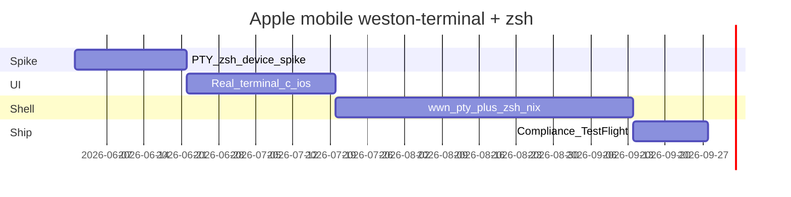

# Implementation Roadmap: Weston Terminal + ZSH on Apple Mobile

Phased delivery plan for the world's first App Store–compliant bundled native zsh on iOS/iPadOS. **Phase 0 is a hard gate** for Phase 2 shell integration.

Master plan file: `.cursor/plans/ios_weston_terminal_zsh_b55c5cd8.plan.md`

---

## Phase overview

| Phase | Goal | Exit criteria |
|-------|------|---------------|
| **0** | Prove PTY + spawn on device | Spike report signed off |
| **1** | Real `terminal.c` UI (no shell) | cairo terminal on device; SHM stub deleted |
| **2** | `wawona-pty` + `zsh-ios` + rootfs | Interactive zsh in terminal window |
| **3** | Compliance + TestFlight | Review notes, matrix green, external beta |
| **4** | Polish | foot, extra tools, remote presets |



---

## Phase 0 — PTY + zsh spawn spike (GATE)

**Owner deliverable:** [../legacy/ios-local-shell-spike.md](../legacy/ios-local-shell-spike.md) filled with device results.

| Task | Path / output |
|------|----------------|
| Nix: static `zsh` for `aarch64-apple-ios` | `wwn-zsh/dependencies/libs/zsh/ios.nix` |
| Spike harness | `wwn-weston/dependencies/clients/weston/ios-pty-spike/` or XCTest target |
| Flake outputs | `.#zsh-ios`, `.#wawona-pty-spike-ios` |
| Run on **physical iPhone** | Not simulator-only |

**Tests in spike:**

1. `posix_openpt(O_RDWR | O_NOCTTY)` → master fd
2. `grantpt` / `unlockpt` / `ptsname` → slave path
3. `posix_spawn(rootfs/usr/bin/zsh, …)` with slave dup2 to 0,1,2
4. Write `echo hello\n` → read `hello` from master
5. `cd`, `pwd` in interactive session
6. Record memory (Instruments) and background jetsam

**Exit:** Interactive echo works **OR** documented fallback (pipe-TTY) approved for Phase 2.

**PR:** PR0 — spike + flake + spike doc only (no terminal.c yet).

---

## Phase 1 — Real weston-terminal UI (no shell)

**Goal:** Replace `mobile-weston-terminal.c` SHM placeholder with upstream terminal **visual** client.

### Nix / build tasks

1. Extract patches from `wwn-weston/dependencies/clients/weston/macos.nix` → `wwn-weston/dependencies/clients/weston/terminal-patches/`
   - `WESTON_HOWMANY` / scrollback
   - OSC 7 cwd-as-title
   - iOS hook: `#ifdef __APPLE__` → `wwn_pty_spawn` stub returning friendly error until Phase 2

2. Edit `wwn-weston/dependencies/clients/weston/ios.nix`:
   - Compile patched `clients/terminal.c`
   - Link cairo/pango closure (existing `cairo/ios.nix`, `pango/ios.nix`)
   - `-Dmain=weston_terminal_main`
   - **Remove** `mobile-weston-terminal.c` from default build

3. Add `pty.h` / `util.h` include path for iOS compile (mirror macOS)

4. Verify `-force_load libweston-terminal.a` in `weston-toytoolkit-ldflags.nix` / `xcodegen.nix`

### Runtime (mostly done)

| Feature | Status |
|---------|--------|
| `mobile-weston-client-launch.c` → `weston-terminal` | Done |
| `WWNWaypipeRunner` `launchWestonTerminal` | Done |
| `wwn_mobile_consume_wayland_socket_fd()` | Done |

**Phase 1 UX:** Terminal renders; shell area shows error string until Phase 2.

**Verify:**

```bash
nix build .#weston-ios
# device: nested Weston launcher + native machine profile
```

Update [../testing/everywhere-matrix.md](../testing/everywhere-matrix.md) line for `weston-terminal`.

**PR:** PR1 — terminal patches + ios.nix + delete SHM stub.

---

## Phase 2 — Bundled zsh + Wawona PTY layer

### 2a — `wawona-pty` library

Package: `wwn-toolchain/dependencies/libs/wawona-pty/`

- C API: [WAWONA-PTY-SPEC.md](WAWONA-PTY-SPEC.md)
- Static archive `libwwn-pty.a` for iOS + sim
- Unit tests on macOS host where possible; device tests via spike

### 2b — `zsh-ios` + rootfs

- `wwn-zsh/dependencies/libs/zsh/ios.nix` — zsh 5.9+ static
- `dependencies/wawona/ios-rootfs.nix` — aggregate rootfs (Wawona integration)
- Register in `wwn-toolchain/dependencies/toolchains/common/registry.nix`

Details: [ROOTFS-AND-ZSH.md](ROOTFS-AND-ZSH.md)

### 2c — App integration

| Component | Work |
|-----------|------|
| `xcodegen.nix` | Copy `wawona-rootfs` into Resources |
| `WWNRootfsManager` (new) | First-launch extract to Application Support |
| `WWNWaypipeRunner.m` | Set `HOME`, `PATH`, `WAWONA_SHELL`, … |
| Link | `libwwn-pty.a` + `libweston-terminal.a` |

### 2d — Patch `terminal.c` spawn sites

```c
#if defined(__APPLE__) && (TARGET_OS_IPHONE || TARGET_OS_TV || TARGET_OS_WATCH)
  pid = wwn_pty_spawn_shell(WAWONA_SHELL, argv, slave_fd, envp);
#else
  pid = forkpty(...);
#endif
```

**Do not** change `compositor-apple-mobile.nix` `fork()` stub.

**PR:** PR2 — pty + zsh + rootfs + spawn integration.

---

## Phase 3 — Compliance, security, TestFlight

| Task | Doc |
|------|-----|
| Update policy traceability | [../compliance/policy-traceability.md](../compliance/policy-traceability.md) |
| App Review copy | [APP-REVIEW-NOTES.md](APP-REVIEW-NOTES.md) |
| QA checklist | [TESTFLIGHT-CHECKLIST.md](TESTFLIGHT-CHECKLIST.md) |
| Matrix + CI attrs | [../testing/everywhere-matrix.md](../testing/everywhere-matrix.md) |
| Optional Settings toggle | "Enable local shell" |

**PR:** PR3 — docs + settings + CI targets `.#zsh-ios`.

---

## Phase 4 — Ecosystem polish

| Item | Notes |
|------|-------|
| Nested Weston launcher | Already `path=weston-terminal` in `wwnWriteWestonIniAtPath` |
| Extra rootfs tools | `grep`, coreutils subset (a-Shell model) |
| foot client | After spawn proven; shares PTY layer |
| Remote preset | "Remote dev shell" — waypipe, zero local PTY |
| watchOS | [WATCHOS-SCOPE.md](WATCHOS-SCOPE.md) only |

---

## PR sequence summary

| PR | Scope |
|----|-------|
| **PR0** | Phase 0 spike + `docs/ios-local-shell-spike.md` + flake |
| **PR1** | terminal-patches + real `terminal.c` in ios.nix |
| **PR2** | wawona-pty + zsh-ios + rootfs + spawn |
| **PR3** | Compliance docs, TestFlight, matrix, env wiring |

---

## Risks and mitigations

| Risk | Likelihood | Mitigation |
|------|------------|------------|
| `grantpt` fails on device | Medium | Phase 0; pipe-TTY fallback in wwn-pty |
| zsh binary >50 MB | Medium | strip, `--disable-*`, audit share files |
| Job control / pipeline fork limits | High | Document; zsh flags; long-term ios_system-style builtins |
| App Review "arbitrary code" | Medium | Review notes; bundled-only enforcement |
| watchOS scope creep | Low | Explicit stub doc |
| Jetsam with nested Weston + zsh | Medium | One shell; reap on session teardown |
| Phase 1 regression (input/render) | Medium | Matrix smoke; keep SHM behind flag until stable |

---

## Success criteria (iOS / iPadOS)

1. Nested Weston → launcher → **real** cairo terminal (scrollback, resize, OSC title).
2. Native machine profile "weston-terminal" → same on Wawona compositor.
3. Prompt from **bundled zsh**; `echo`, `cd`, `ls` (bundled) work in container.
4. No JIT; no downloaded native binaries; spawn rejects non-rootfs paths.
5. CI: `nix build .#weston-ios` + `.#wawona-ios-backend` + `.#zsh-ios` green.

---

## Current codebase status (2026-06)

| Item | State |
|------|-------|
| `wwn-zsh/dependencies/libs/zsh/` | **Shipped** (flake input) |
| `wwn-toolchain/dependencies/libs/wawona-pty/` | **Shipped** (flake input) |
| `WWNRootfsManager` | **Implemented** (`src/platform/ios/`) |
| In-process launch plumbing | **Done** |
| This documentation set | **Maintained** |
