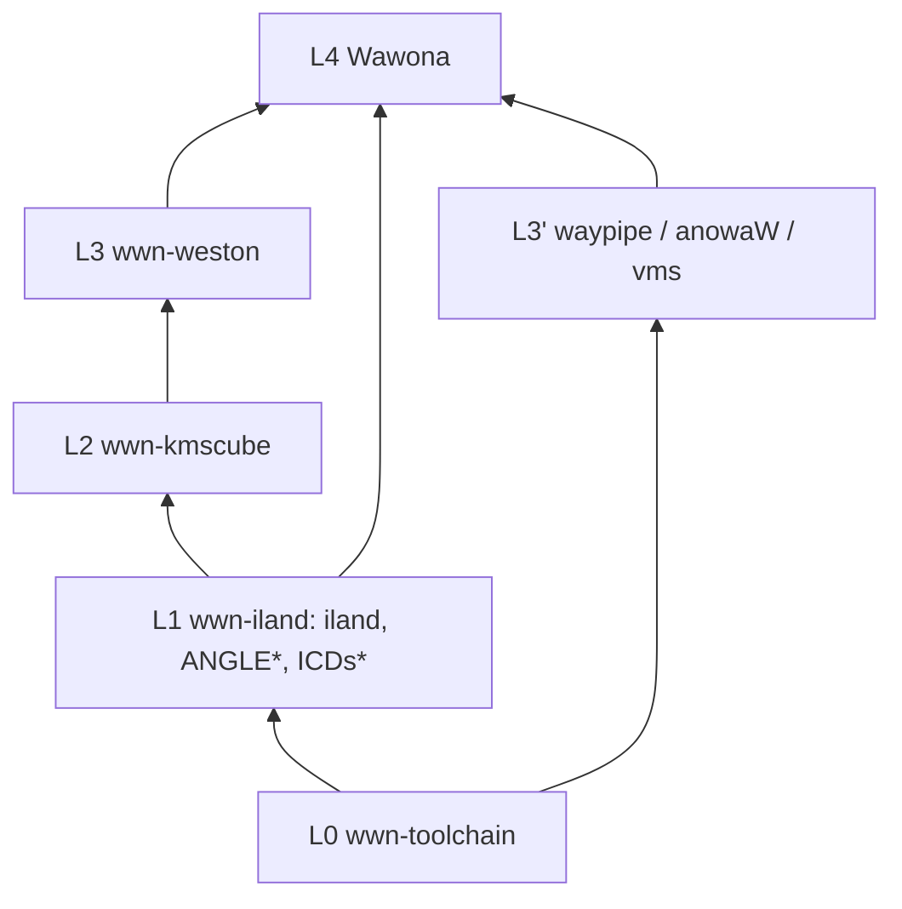

# Wawona repo DAG — acyclic layering (L0–L4)

Canonical, AI-enforced dependency layering for the Wawona organization repos.
**Never invert these layers.** When adding a flake input or a registry key,
re-read this file and the cycle watch list first.

> **Status:** DRAFT (created in graphics-stack epic P0, research-only). Some
> statements describe the **target** state after the P2 registry move (ANGLE /
> SwiftShader → `wwn-iland`). Rows marked *(P2)* are not yet reality; see
> [`iland-graphics-progress.md`](iland-graphics-progress.md) R11 for current
> ownership. This doc is hardened + mirrored into Cursor rules / AGENTS.md in
> P1/P2.

Mirrors:
- Cursor rule: `.cursor/rules/wawona-repo-dag.mdc` **and**
  `Wawona/.cursor/rules/wawona-repo-dag.mdc` (`alwaysApply: true`) — *(P1)*.
- AGENTS: `Wawona/AGENTS.md`, `wwn-iland/AGENTS.md`, `wwn-toolchain/AGENTS.md`.
- READMEs: `wwn-toolchain/README.md`, `wwn-iland/README.md`.
- WWN-MCP: `wwn-mcp/knowledge/wawona/wwn-repo-dag.md` *(P4)*.

## Layers

```text
L0  wwn-toolchain     builders + substrate libs (NO wwn-* flake inputs)
L1  wwn-iland         complete graphics stack fragment (→ toolchain only)
L2  wwn-kmscube       GL acceptance client (→ toolchain + iland)
L3  wwn-weston        nested compositor (→ toolchain + iland + kmscube; ilandSrc=source only)
L3′ wwn-waypipe, wwn-anowaW, wwn-vms, wwn-apt, wwn-ssh, …  (→ toolchain; peers only downward)
L4  Wawona            merges all fragments; never an input of L0–L3
```



`*` ANGLE + SwiftShader move from L0 to L1 in P2 (see below).

## What lives where

| Layer | Repo | Owns |
|-------|------|------|
| **L0** | `wwn-toolchain` | Cross builders (`mkToolchains`, apple/android toolchains, `wawona-pty`); substrate libs: **cairo, cairo-gobject, pango, fontconfig, freetype, harfbuzz, fribidi, glib, pixman, libwayland, xkbcommon, epoll-shim, libpng, expat, libffi, libintl, libxml2, zlib, zstd, lz4, pcre2, openssl, mbedtls, fcft, tllist, utf8proc, ffmpeg** |
| **L1** | `wwn-iland` | Userland KMS/DRM/GBM/EGL/udev shims + Mode A present callback + Mode B baremetal; `iland`, `iland-baremetal`; **ANGLE, SwiftShader, MoltenVK, KosmicKrisp, Turnip hooks** *(P2)*; `iland-cpu` CPU-present helpers *(P1–P2)*; DriverSelector surface |
| **L2** | `wwn-kmscube` | `kmscube`, `vkcube`, `opengl-cube`, GL acceptance clients |
| **L3** | `wwn-weston` | Nested compositor + weston-simple-egl + toytoolkit clients |
| **L3′** | `wwn-waypipe`, `wwn-anowaW`, `wwn-vms`, `wwn-apt`, `wwn-ssh`, … | Proxy / Android present / VM engine / package tooling |
| **L4** | `Wawona` | App integration, Settings, presenters, SIP/Desktop, Android JNI, CI, docs, `flake.lock` hub |

## Hard rules

1. **L0 never imports L1+** — never add `wwn-iland`/weston/kmscube as
   `wwn-toolchain` flake inputs or into `baseRegistry`.
2. **L1 never imports L2+** — iland must not flake- or build-depend on weston,
   kmscube, waypipe, Wawona, or toytoolkit.
3. **Registry merge only upward** — consumers do `baseRegistry // ilandFragment
   // …`; never merge app fragments back into toolchain's published
   `baseRegistry`.
4. **Source injection ≠ cycle** — `extraArgs.ilandSrc` (weston copies shims) is
   OK; building iland *from* weston sources is not.
5. **One-way optional clients** — weston → kmscube OK; kmscube → weston forbidden.
6. **Graphics keys live in L1 fragment** after P2 (`angle`, `swiftshader`, MVK,
   KK); substrate text stack stays L0. Consumers needing GLES/Vulkan merge the
   **iland** fragment (or Wawona's merge), not bare toolchain.

## Current reality vs target (P0 finding)

- Flake-input edges are **already acyclic** L0→L4 — no inversions (verified:
  toolchain has no wwn-* inputs; iland → toolchain only; weston → toolchain +
  iland + kmscube; waypipe/anowaW/vms → toolchain; Wawona → all).
- **Deviation:** `angle` and `swiftshader` currently sit in L0 `baseRegistry`
  (`wwn-toolchain/dependencies/toolchains/common/registry.nix:280-290,58-63`).
  These are graphics-stack keys → **move to L1 in P2**.
- `moltenvk` = `pkgs.moltenvk` (nixpkgs, wired in Wawona); `kosmickrisp` has no
  recipe. Both become L1-owned/wired in P2.
- `pixman` correctly L0 (cairo depends on it). **Do not move to iland** — would
  force cairo→iland cycle.

## Cycle / loop failure points (watch list)

| Risk | How it happens | Correct fix |
|------|----------------|-------------|
| **pixman in iland** | cairo (L0) needs pixman; iland owns pixman → cairo→iland → L0→L1→L0 | **pixman stays L0**; `iland-cpu` *uses* it |
| **cairo/pango in iland** | weston/GTK pull text stack through graphics | **Stay L0** |
| **angle left in L0 and L1** | Duplicate keys / merge fights | Single owner **L1** after move; L0 fail-loud stub |
| **iland → weston "for testing"** | Flake or recipe edge L1→L3 | Tests in kmscube/weston/Wawona; iland stays leaf |
| **toolchain baseRegistry absorbs iland/weston** | "Simplify" by vendoring fragments into toolchain | Forbidden; breaks every consumer DAG |
| **kmscube → weston** | Shared demo code pulled upward | Duplicate minimal stubs or keep demos in weston |
| **waypipe → iland flake + iland → waypipe** | Zero-copy "shared crate" both ways | waypipe → iland (or only Wawona wires both); iland exposes C ABI only |
| **anowaW → weston flake** | Nested compositor as flake input | Runtime/product launch only; anowaW → toolchain (+ optional iland if GPU) |
| **Wawona as input of any wwn-*** | App headers leaking into libs | Use `wawonaSrc` extraArgs sparingly; never flake input L4→L0 |
| **freetype↔harfbuzz↔cairo** | Classic meson cycles | Keep disabled edges in ios/android recipes |
| **spirv-tools / ffmpeg in wrong layer** | If only graphics needs spirv, OK L1; if foot/ssh need it, keep L0 | Prefer L0 unless proven graphics-only |
| **MVK/KK recipe needing full mesa + iland headers** | Mesa build pulls iland | KK/MVK builds are standalone ICDs; iland *links* them |
| **Android Turnip in toolchain** | Adreno ICD next to cairo | Turnip packaging = **L1**; KGSL is not substrate |

## Who must merge `wwn-iland` after the P2 move

Anyone calling `buildFor* "angle"` / a Vulkan ICD / `iland`: **wwn-kmscube**,
**wwn-weston**, **wwn-waypipe** (GPU), **Wawona**. Repos that only need
cairo/pango/text (**wwn-foot**, etc.) keep **toolchain-only** merge — no forced
iland.

## Land order (multi-repo)

Push L1 before L4 lock: `wwn-iland` → (`wwn-toolchain`/`wwn-waypipe`/`wwn-weston`/
`wwn-kmscube`/`wwn-anowaW` as touched) → bump `Wawona` `flake.lock`. **Never open
PRs that invert layers.** Any `flake.nix`/`registry.nix` change must update or
cite this doc in the same phase iteration.

## AI-facing rule text (verbatim into Cursor rule)

```text
Wawona repo DAG (acyclic, never invert):
  L0 wwn-toolchain — substrate only (cairo, pango, pixman, libwayland, …). NO wwn-* flake inputs. NO iland/weston in baseRegistry.
  L1 wwn-iland — complete graphics stack (iland, ANGLE, SwiftShader, MoltenVK, KosmicKrisp, Turnip hooks). Depends on toolchain ONLY.
  L2 wwn-kmscube — toolchain + iland.
  L3 wwn-weston — toolchain + iland + kmscube; ilandSrc is source injection only.
  L3′ waypipe / anowaW / vms / apt — toolchain; merge iland only if GPU needed; no weston flake edge from anowaW.
  L4 Wawona — merges fragments; never an input of L0–L3.

FORBIDDEN: pixman/cairo/pango moved into iland; angle left owned by toolchain after graphics move;
iland→weston/kmscube/waypipe; toolchain←iland/weston; kmscube→weston; Wawona as input of any wwn-*.
When unsure, open docs/wwn-repo-dag.md and the cycle watch list before editing flakes.
```
