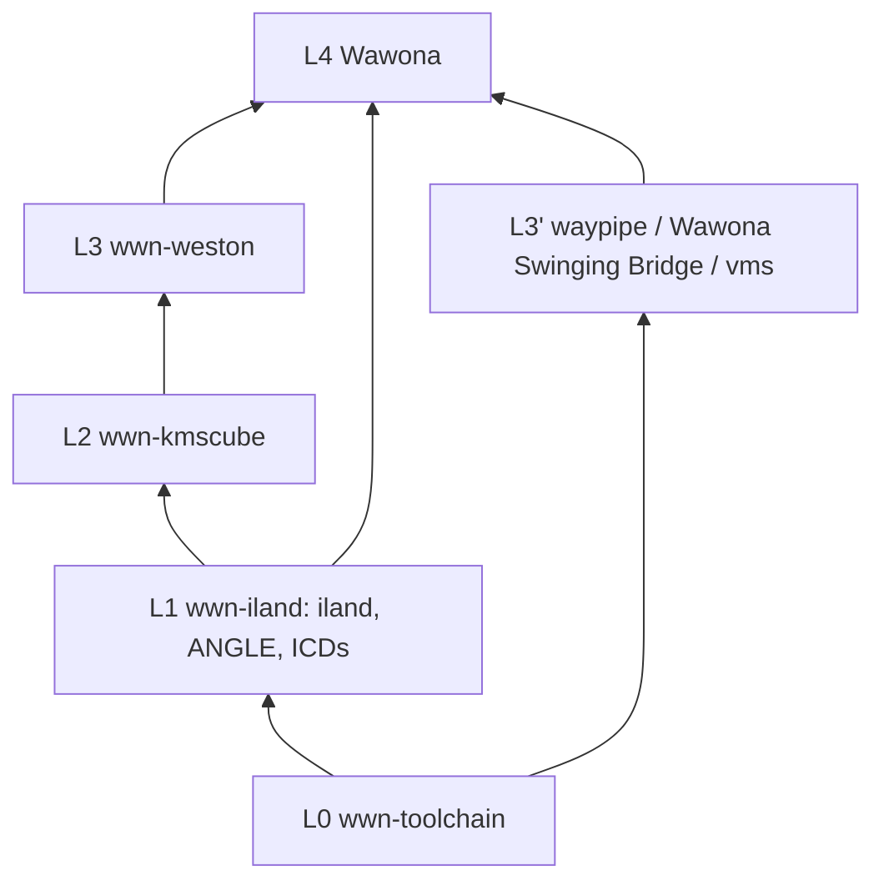

# Wawona repo DAG. Acyclic layering (L0-L4)

Canonical, AI-enforced dependency layering for the Wawona organization repos.
**Never invert these layers.** When adding a flake input or a registry key,
re-read this file and the cycle watch list first.

> **Status:** ENFORCED. ANGLE and SwiftShader recipes are owned by
> `wwn-iland.registryFragment`; `wwn-toolchain` retains substrate only. See
> [`iland-graphics-progress.md`](iland-graphics-progress.md) for verification
> status.

Mirrors:
- Cursor rule: `.cursor/rules/wawona-repo-dag.mdc` **and**
  `Wawona/.cursor/rules/wawona-repo-dag.mdc` (`alwaysApply: true`). *(P1)*.
- AGENTS: `Wawona/AGENTS.md`, `wwn-iland/AGENTS.md`, `wwn-toolchain/AGENTS.md`.
- READMEs: `wwn-toolchain/README.md`, `wwn-iland/README.md`.
- WWN-MCP: `wwn-mcp/knowledge/wawona/wwn-repo-dag.md`.

## Layers

```text
L0  wwn-toolchain     builders + substrate libs (NO wwn-* flake inputs)
L1  wwn-iland         complete graphics stack fragment (→ toolchain only)
L2  wwn-kmscube       GL acceptance client (→ toolchain + iland)
L3  wwn-weston        nested compositor (→ toolchain + iland + kmscube; ilandSrc=source only)
L3′ wwn-waypipe, Wawona-Swinging-Bridge, wwn-vms, wwn-containers, wwn-ssh,
    wwn-fastfetch, wwn-phoon-rs, wwn-neovim, wwn-foot, wwn-wasm, wwn-niri,
    wwn-iowatchdog, wwn-vphone, wwn-iomfb-rs, doorman, wwn-igetty, …  (→ toolchain or nixpkgs-only; peers only downward)
L4  Wawona            merges all fragments; never an input of L0-L3
```



## What lives where

| Layer | Repo | Owns |
|-------|------|------|
| **L0** | `wwn-toolchain` | Cross builders (`mkToolchains`, apple/android toolchains, `wawona-pty`); substrate libs: **cairo, cairo-gobject, pango, fontconfig, freetype, harfbuzz, fribidi, glib, pixman, libwayland, xkbcommon, epoll-shim, libpng, expat, libffi, libintl, libxml2, zlib, zstd, lz4, pcre2, openssl, mbedtls, fcft, tllist, utf8proc, ffmpeg** |
| **L1** | `wwn-iland` | Userland KMS/DRM/GBM/EGL/udev shims + Mode A present callback + Mode B baremetal; `iland`, `iland-baremetal`; **ANGLE and SwiftShader**; MoltenVK/KosmicKrisp packaging; `iland-cpu` CPU-present helpers; DriverSelector contract |
| **L2** | `wwn-kmscube` | `kmscube`, `vkcube` (Wayland) + `vkcube-kms` (KMS/GBM), `gbm-es2-demo`, `opengl-cube`. Wawona pins `github:Wawona/wwn-kmscube/development` until FlakeHub rolling includes `vkcube-kms`. |
| **L3** | `wwn-weston` | Dual-backend compositor: nested Wayland *and* DRM/KMS (`--backend=drm`) + weston-simple-egl + toytoolkit clients |
| **L3′** | `wwn-waypipe`, `Wawona-Swinging-Bridge`, `wwn-vms`, `wwn-containers`, `wwn-ssh`, `wwn-fastfetch`, `wwn-phoon-rs`, `wwn-neovim`, `wwn-foot`, `wwn-wasm`, `wwn-iowatchdog`, `wwn-vphone`, `wwn-iomfb-rs`, `doorman`, `wwn-igetty`, … | Proxy / Android present / VM engine / OCI containers / in-process shell-tool ports (`*_main` C ABI, force-loaded static libs); `wwn-wasm` is the WASI P1/P2 **Wawona Runtime** (optional software = Wasm packages, not StoreKit ODR); `wwn-iowatchdog` is macOS Watchdog tools for Desktop Mode B (nixpkgs-only, never Apple-mobile); `wwn-vphone` is Darwin jailbroken iOS research lab via vphone-cli (nixpkgs-only; **never** ships a prebuilt iOS VM / IPSW); `wwn-iomfb-rs` is reconstructed iOS IOMobileFramebuffer (MIT, nixpkgs-only; TrollStore runtime; **L1 must not import this**; Wawona L4 may depend later); `doorman` is macOS user auth (Linux PAM-shaped; never Apple-mobile); `wwn-igetty` is Linux-shaped VT switching + Doorman getty on iland DRM after WindowServer is gone (never the Mode B dylib; that is L1 `iland-baremetal`) |
| **L4** | `Wawona` | App integration, Settings, presenters, SIP/Desktop, Android JNI, CI, docs, `flake.lock` hub |

## Hard rules

1. **L0 never imports L1+**. Never add `wwn-iland`/weston/kmscube as
   `wwn-toolchain` flake inputs or into `baseRegistry`.
2. **L1 never imports L2+**. Iland must not flake- or build-depend on weston,
   kmscube, waypipe, Wawona, or toytoolkit.
3. **Registry merge only upward**. Consumers do `baseRegistry // ilandFragment
   // …`; never merge app fragments back into toolchain's published
   `baseRegistry`.
4. **Source injection ≠ cycle**. `extraArgs.ilandSrc` (weston copies shims) is
   OK; building iland *from* weston sources is not.
5. **One-way optional clients**. Weston → kmscube OK; kmscube → weston forbidden.
6. **Graphics keys live in L1 fragment** (`angle`, `swiftshader`, MVK,
   KK); substrate text stack stays L0. Consumers needing GLES/Vulkan merge the
   **iland** fragment (or Wawona's merge), not bare toolchain.

## Current reality

- Flake-input edges are **already acyclic** L0→L4. No inversions (verified:
  toolchain has no wwn-* inputs; iland → toolchain only; weston → toolchain +
  iland + kmscube; waypipe/swinging-bridge/vms → toolchain; Wawona → all).
- Org-internal URLs are FlakeHub rolling
  (`https://flakehub.com/f/Wawona/<repo>/*`); `follows` still enforce the DAG.
  Exceptions already on `github:Wawona/<repo>/development`: `wwn-iland`,
  `wwn-weston`, `wwn-containers` (until FlakeHub rolling has
  `stdenv.hostPlatform.isDarwin`); `wwn-toolchain` (until FlakeHub rolling
  includes pip-free Meson Python envs, `c3855db`); `wwn-waypipe` (until
  FlakeHub rolling includes the `--no-gpu` wrap interpolation, `f8ca65d`);
  `wwn-wasm` (`github/.../development` until FlakeHub rolling includes the
  wayland-shm example, `cd7a800`). `wwn-zsh` is `github:.../main` until
  FlakeHub rolling includes the iOS HOME physicalize fix (`0e41745`).
  See [`flakehub-registry.md`](./flakehub-registry.md).
- `angle` and `swiftshader` recipes live in `wwn-iland/dependencies/libs/` and
  are exported by the L1 `registryFragment`. `angle.tvos` uses the same
  `ios.nix` source GN as visionOS (`target_platform=tvos`). Their old L0
  recipes are removed; consumers must merge L1 before requesting either key.
- `moltenvk` = `pkgs.moltenvk` (nixpkgs, wired in Wawona); `kosmickrisp` has no
  recipe. Both become L1-owned/wired in P2.
- `pixman` correctly L0 (cairo depends on it). **Do not move to iland**. Would
  force cairo→iland cycle.

## Cycle / loop failure points (watch list)

| Risk | How it happens | Correct fix |
|------|----------------|-------------|
| **pixman in iland** | cairo (L0) needs pixman; iland owns pixman → cairo→iland → L0→L1→L0 | **pixman stays L0**; `iland-cpu` *uses* it |
| **cairo/pango in iland** | weston/GTK pull text stack through graphics | **Stay L0** |
| **angle left in L0 and L1** | Duplicate keys / merge fights | Single owner **L1** after move; L0 fail-loud stub |
| **iland → weston "for testing"** | Flake or recipe edge L1→L3 | Tests in kmscube/weston/Wawona; iland stays leaf |
| **toolchain baseRegistry absorbs iland/weston** | "Simplify" by vendoring fragments into toolchain | Forbidden; breaks every consumer DAG |
| **kmscube → weston** | Shared demo code pulled upward | Duplicate minimal stubs or keep demos in weston |
| **waypipe → iland flake + iland → waypipe** | Zero-copy "shared crate" both ways | waypipe → iland (or only Wawona wires both); iland exposes C ABI only |
| **Wawona Swinging Bridge → weston flake** | Nested compositor as flake input | Runtime/product launch only; Wawona Swinging Bridge → toolchain (+ optional iland if GPU) |
| **Wawona as input of any wwn-*** | App headers leaking into libs | Use `wawonaSrc` extraArgs sparingly; never flake input L4→L0 |
| **wwn-iland → wwn-iomfb-rs** | L1 imports libre IOMFB | Forbidden. `wwn-iomfb-rs` is L3′ nixpkgs-only. Wawona L4 may depend later |
| **wwn-wasm → iland / weston** | Wayland fd-bridge tempting a graphics flake edge | Host uses existing `XDG_RUNTIME_DIR` unix sockets; **toolchain only** |
| **freetype↔harfbuzz↔cairo** | Classic meson cycles | Keep disabled edges in ios/android recipes |
| **spirv-tools / ffmpeg in wrong layer** | If only graphics needs spirv, OK L1; if foot/ssh need it, keep L0 | Prefer L0 unless proven graphics-only |
| **MVK/KK recipe needing full mesa + iland headers** | Mesa build pulls iland | KK/MVK builds are standalone ICDs; iland *links* them |
| **Direct Turnip/KGSL** | App-owned ICD opens a kernel device | Excluded by runtime-only policy; use system Vulkan or SwiftShader |
| **apple-container in L0** | Toolchain absorbs Apple `container` / Containerization | **macOS-only, L3′ `wwn-containers`**; `baseRegistry` throws |

## Who must merge `wwn-iland` after the P2 move

Anyone calling `buildFor* "angle"` / a Vulkan ICD / `iland`: **wwn-kmscube**,
**wwn-weston**, **wwn-niri** (macOS Mode B DRM/KMS tty), **wwn-waypipe** (GPU),
**Wawona**. Repos that only need cairo/pango/text (**wwn-foot**, etc.) keep
**toolchain-only** merge. No forced iland.

## Land order (multi-repo)

Push L1 before L4 lock: `wwn-iland` → (`wwn-toolchain`/`wwn-waypipe`/`wwn-weston`/
`wwn-kmscube`/`Wawona-Swinging-Bridge` as touched) → bump `Wawona` `flake.lock`. **Never open
PRs that invert layers.** Any `flake.nix`/`registry.nix` change must update or
cite this doc in the same phase iteration.

## AI-facing rule text (verbatim into Cursor rule)

```text
Wawona repo DAG (acyclic, never invert):
  L0 wwn-toolchain. Substrate only (cairo, pango, pixman, libwayland, …). NO wwn-* flake inputs. NO iland/weston in baseRegistry.
  L1 wwn-iland. Complete graphics stack (iland, ANGLE, SwiftShader, MoltenVK, KosmicKrisp). Depends on toolchain ONLY.
  L2 wwn-kmscube. Toolchain + iland.
  L3 wwn-weston. Toolchain + iland + kmscube; ilandSrc is source injection only.
  L3′ waypipe / Wawona Swinging Bridge / vms / apt / iomfb-rs. Toolchain or nixpkgs-only; merge iland only if GPU needed; no weston flake edge from Wawona Swinging Bridge. L1 must not import wwn-iomfb-rs.
  L4 Wawona. Merges fragments; never an input of L0-L3.

FORBIDDEN: pixman/cairo/pango moved into iland; angle left owned by toolchain after graphics move;
iland→weston/kmscube/waypipe; toolchain←iland/weston; kmscube→weston; Wawona as input of any wwn-*.
When unsure, open docs/wwn-repo-dag.md and the cycle watch list before editing flakes.
```
